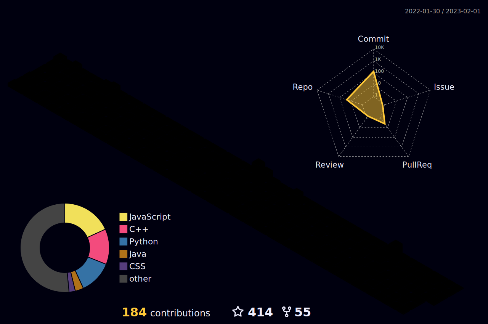

<!-- <h1 align="center">Hi 👋, I'm Dheeraj Pal</h1>
<h3 align="center">A passionate full stack web developer from India</h3>

  

  

---

- 🌱 I’m currently learning **Node.js, MongoDB, Express.js**

- 👨‍💻 All of my projects are available at [Portfolio](https://dheeraj-pal.github.io/)

- 💬 Ask me about **HTML, CSS, JavaScript**

- 📫 How to reach me **dheeraj.pal19@gmail.com**

- 📄 Know about my experiences [Resume](https://drive.google.com/file/d/17kbXv9IRArX26dObGs4mIl_FxLO3XYXs/view?usp=sharing)

- ⚡ Fun fact **I know how to fly**

---

<h3 align="left">Connect with me:</h3>

---

<h3 align="left">Languages and Tools:</h3>

             

---

&nbsp;

 -->
 
 
 
 
 
 
 
 
 
 
 
 

 
 
  

 

### :man_technologist: I'm Dheeraj Pal and I'm a Web Developer

- 🌱 All of my projects are available at [Portfolio](https://dheeraj-pal.github.io/)
- 📫 How to reach me **dheeraj.pal19@gmail.com**
- 📄 Know about my experiences [Resume](https://drive.google.com/file/d/17kbXv9IRArX26dObGs4mIl_FxLO3XYXs/view?usp=sharing)
- ⚡ Fun fact **I know how to fly**

 
<h2>Social Networks</h2>

[![LinkedIn][2.2]][2] [![Instagram][3.2]][3] [![Telegram][4.2]][4]

[2.2]: https://s4.uupload.ir/files/linkedin_amwn.png
[3.2]: https://s4.uupload.ir/files/instagram_6djz.png
[4.2]: https://s4.uupload.ir/files/telegram_q47u.png

[2]: https://www.linkedin.com/in/dheerajpal19/
[3]: https://www.instagram.com/be.dheeraj/
[4]: https://telegram.me/Dheerajpal19

 
 

 
<h2>Skills</h2>

  

  

  
<b>:gear: &nbsp;Git statistics</b>

 
 
<!--  

  
  
  

 -->

  

  
  
 

 
 
 

